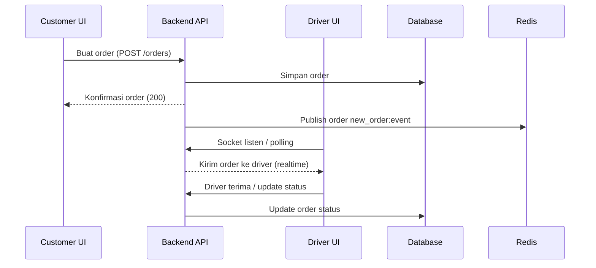
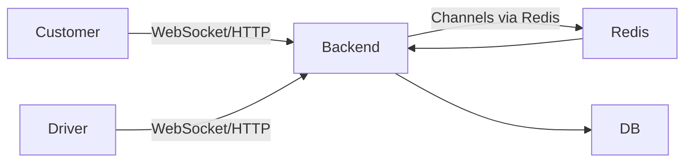

# Struktur dan Flow — Backend, Admin, Driver, Customer

Panduan singkat yang menunjukkan struktur direktori utama dan alur (flow) antara frontend (admin/driver/customer) dan backend.

**Ringkasan**
- Backend: Django (apps: orders, chat, users, pricing, dll.)
- Admin / Driver / Customer: aplikasi frontend terpisah (folder `frontend-admin`, `frontend-driver`, `frontend-customer`)

**Struktur Proyek (sekilas)**

```
./
├─ backend/                  # Django backend
│  ├─ manage.py
│  ├─ requirements.txt
│  ├─ branch/, chat/, orders/, users/, pricing/, ...
│  ├─ static/, templates/
│  └─ start-asgi.* (ASGI entrypoints untuk Channels/WebSocket)
├─ frontend-admin/           # Admin single-page app (React/Vite/Create React App)
│  ├─ package.json
│  └─ src/
├─ frontend-driver/          # Driver app (web/mobile web)
│  ├─ package.json
│  └─ src/
├─ frontend-customer/        # Customer app (web/mobile web)
│  ├─ package.json
│  └─ src/
└─ docker-compose.yml, nginx.conf, deploy scripts
```

**Komponen Backend (umum)**
- Django REST API (HTTP endpoints) — otentikasi, orders, pricing, users
- Channels / WebSocket — real-time chat, lokasi driver, notifikasi
- Database (Postgres atau sejenis)
- Cache / Broker (Redis) — session, channels, Celery broker
- Worker (Celery) — tugas background (notifikasi, settlement, dsb.)

**Alur Umum (overview)**

```mermaid
flowchart LR
  Customer[Customer Frontend]
  Admin[Admin Frontend]
  Driver[Driver Frontend]
  Backend[Backend (Django REST + Channels)]
  DB[(Database)]
  Redis[(Redis / Cache / Broker)]
  Celery[(Celery Workers)]

  Customer -->|HTTP REST| Backend
  Admin -->|HTTP REST| Backend
  Driver -->|HTTP REST| Backend
  Driver -->|WebSocket (realtime location)| Backend
  Backend --> DB
  Backend --> Redis
  Backend --> Celery
  Celery --> DB
  Backend -->|Pub/Sub| Redis
```

**Flow detail: Order (Customer → Backend → Driver)**



**Flow detail: Chat / Notifikasi Real-time**



**Catatan & Lokasi Kode**
- Kode backend utama berada di folder `backend/`.
- App orders ada di `backend/orders/` — cek view dan serializer untuk alur pembuatan order.
- Chat/real-time ada di `backend/chat/` dan konsumen Channels (consumers.py).
- Frontend untuk tiap peran ada di `frontend-admin/`, `frontend-driver/`, `frontend-customer/`.

Jika Anda ingin, saya bisa:
- Menambahkan diagram PNG yang di-render dari Mermaid.
- Menyertakan contoh endpoint (path) untuk tiap service.

---
Generated: ringkasan struktur & flow untuk referensi cepat.
